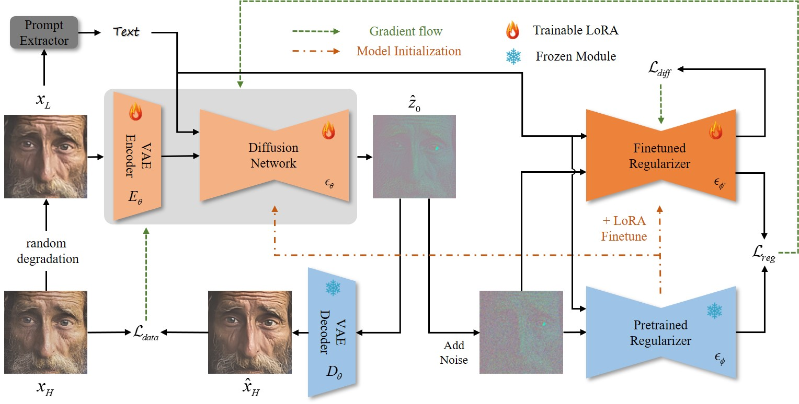
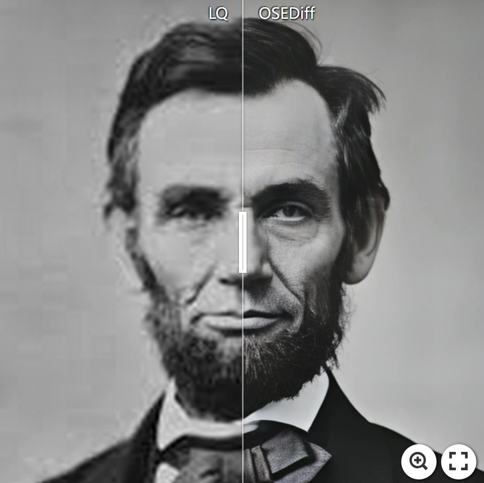
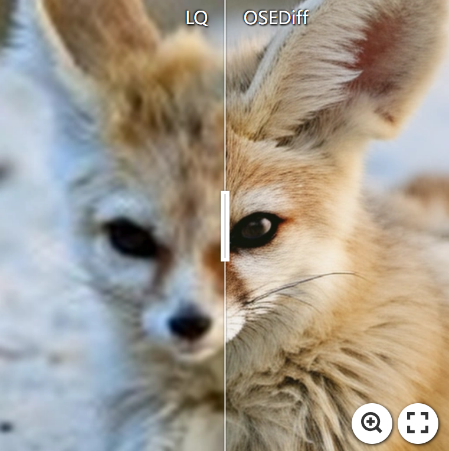
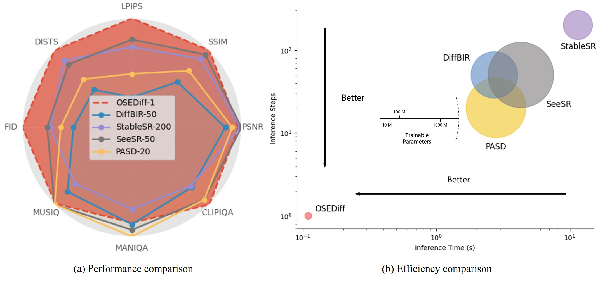
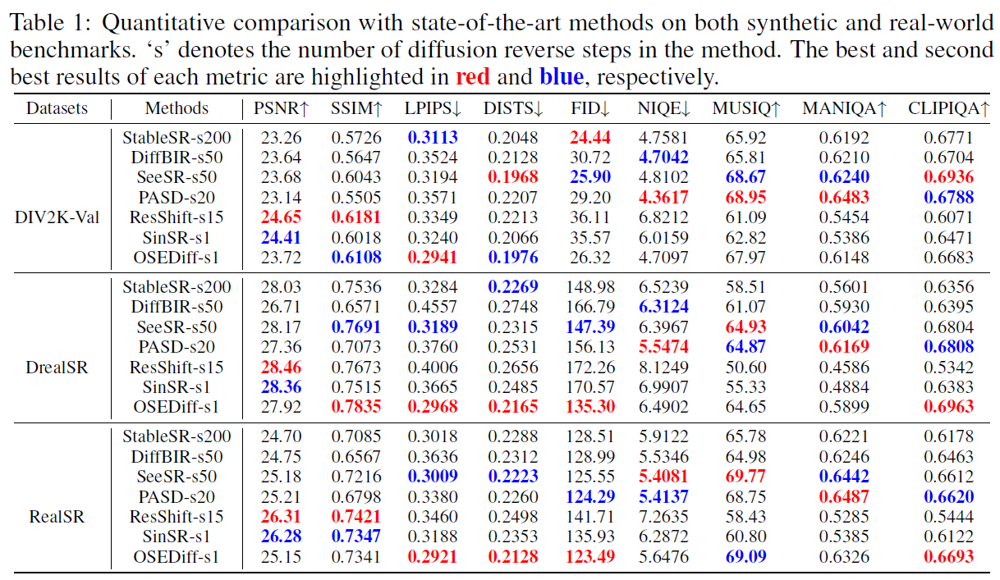
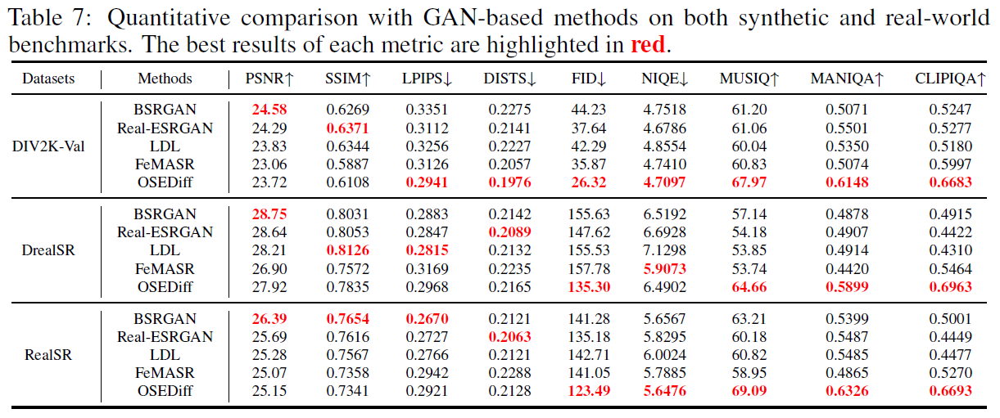

<div align="center">


<h1>One-Step Effective Diffusion Network for Real-World Image Super-Resolution</h1>

<div>
    <a href='https://scholar.google.com/citations?user=A-U8zE8AAAAJ&hl=zh-CN' target='_blank'>Rongyuan Wu<sup>1,2,*</sup></a>&emsp;
    <a href='https://scholar.google.com/citations?user=ZCDjTn8AAAAJ&hl=zh-CN' target='_blank'>Lingchen Sun<sup>1,2,*</sup></a>&emsp;
    <a href='https://scholar.google.com/citations?user=F15mLDYAAAAJ&hl=en' target='_blank'>Zhiyuan Ma<sup>1,*</sup></a>&emsp;
    <a href='https://www4.comp.polyu.edu.hk/~cslzhang/' target='_blank'>Lei Zhang<sup>1,2,† </sup></a>
</div>
<div>
    <sup>1</sup>The Hong Kong Polytechnic University, <sup>2</sup>OPPO Research Institute&emsp; 
</div>

[[paper]](https://arxiv.org/pdf/2406.08177)

---

</div>


#### 🚩Accepted by NeurIPS2024

## 🔥 News
- [2024.10] Updated training codes and [paper](https://arxiv.org/pdf/2406.08177). 💥💥💥Congratulations, OSEDiff has been applied to the OPPO Find X8 series!
- [2024.07] Release OSEDiff-SD21base.
- [2024.06] This repo is created.

:star: If OSEDiff is helpful to your images or projects, please help star this repo. Thanks! :hugs:

## 🎬 Overview



## 🔧 Dependencies and Installation

1. Clone repo
    ```bash
    git clone https://github.com/cswry/OSEDiff.git
    cd OSEDiff
    ```

2. Install dependent packages
    ```bash
    conda create -n OSEDiff python=3.10 -y
    conda activate OSEDiff
    pip install --upgrade pip
    pip install -r requirements.txt
    ```

3. Download Models 
#### Dependent Models
* [SD21 Base](https://huggingface.co/stabilityai/stable-diffusion-2-1-base)
* [RAM](https://huggingface.co/spaces/xinyu1205/recognize-anything/blob/main/ram_swin_large_14m.pth)
* [DAPE](https://drive.google.com/file/d/1KIV6VewwO2eDC9g4Gcvgm-a0LDI7Lmwm/view?usp=drive_link)


## ⚡ Quick Inference
```
python test_osediff.py \
-i preset/datasets/test_dataset/input \
-o preset/datasets/test_dataset/output \
--osediff_path preset/models/osediff.pkl \
--pretrained_model_name_or_path SD21BASE_PATH \
--ram_ft_path DAPE_PATH \
--ram_path RAM_PATH
```

## 🚀 Calculate Inference Time
For easy comparison, we provide the inference time testing script for osediff.
```
python test_inference_time.py \
--osediff_path preset/models/osediff.pkl \
--inference_iterations 500 \
--warmup_iterations 5 \
--process_size 512 \
--pretrained_model_name_or_path SD21BASE_PATH \
--ram_ft_path DAPE_PATH  \
--ram_path RAM_PATH
```
If you run the script on an A100 GPU, you would get
```
Running 5 warm-up iterations...
Starting inference for 500 iterations...
Inference: 100%|███████████████████████████████████████████████████████████████████████████████████████████████████████████████████████████████████████████████████████████████████████████████████████████████████████████████████████████████████████████████████████████████████████████████████████████| 500/500 [00:52<00:00,  9.55it/s]
Average inference time per iteration: 0.1046 seconds.
```

## 📏 Benchmark Results
For convenient comparison, we provide OSEDiff's test results on the RealSR benchmark and DrealSR benchmark in the `preset/datasets/benchmark_realsr/results_osediff` and `preset/datasets/benchmark_drealsr/results_osediff` directory. For the DIV2K validation benchmark, due to the large number of images, we have uploaded the test results to [Google Drive](https://drive.google.com/file/d/1WWYVholKl6f-Ef4g5starGFsB2X79Pqe/view?usp=sharing). These benchmarks were directly copied from [StableSR](https://huggingface.co/datasets/Iceclear/StableSR-TestSets?row=0). Additionally, we also provide a script for testing IQA (Image Quality Assessment).
```
python test_metrics.py \
--inp_imgs preset/datasets/benchmark_realsr/results_osediff \
--gt_imgs preset/datasets/benchmark_realsr/test_HR \
--log preset/datasets/benchmark_realsr/results_osediff/metrics

python test_metrics.py \
--inp_imgs preset/datasets/benchmark_drealsr/results_osediff \
--gt_imgs preset/datasets/benchmark_drealsr/test_HR \
--log preset/datasets/benchmark_drealsr/results_osediff/metrics
```
If you run these two scripts, you would get them at last line, which are consistent with the data presented in Table 1 of our [paper](https://arxiv.org/pdf/2406.08177).
```
RealSR benchmark:
===== Average Metrics for [results_osediff] =====
PSNR: 25.1511; SSIM: 0.7341; LPIPS: 0.2921; DISTS: 0.2128; CLIPIQA: 0.6693; NIQE: 5.6476; MUSIQ: 69.0896; MANIQA: 0.6331 | FID: 123.493817 | FID Runtime: 6.79 sec

DrealSR benchmark:
===== Average Metrics for [results_osediff] =====
PSNR: 27.9243; SSIM: 0.7835; LPIPS: 0.2968; DISTS: 0.2165; CLIPIQA: 0.6963; NIQE: 6.4902; MUSIQ: 64.6537; MANIQA: 0.5895 | FID: 135.296586 | FID Runtime: 8.10 sec
```

## 🌈 Train 
#### Step1: Prepare training data
We use LSDIR (84991) and the first 10k images from FFHQ as our training data. Please write their absolute paths into a txt file. Each line in the txt file should be the absolute path of an image. Just like:


```
LSDIR/HR_merge/0000001.png
LSDIR/HR_merge/0000002.png
...
```

#### Step2: Training for OSEDiff
Pleasr put your txt file path at `YOUR TXT FILE PATH`. If you have 4 GPUs, you can run

```
CUDA_VISIBLE_DEVICES="0,1,2,3," accelerate launch train_osediff.py \
    --pretrained_model_name_or_path=SD21BASE_PATH \
    --ram_path=RAM_PATH \
    --learning_rate=5e-5 \
    --train_batch_size=4 \
    --gradient_accumulation_steps=1 \
    --enable_xformers_memory_efficient_attention --checkpointing_steps 500 \
    --mixed_precision='fp16' \
    --report_to "tensorboard" \
    --seed 123 \
    --output_dir=experience/osediff \
    --dataset_txt_paths_list 'YOUR TXT FILE PATH','YOUR TXT FILE PATH' \
    --dataset_prob_paths_list 1,1 \
    --neg_prompt="painting, oil painting, illustration, drawing, art, sketch, cartoon, CG Style, 3D render, unreal engine, blurring, dirty, messy, worst quality, low quality, frames, watermark, signature, jpeg artifacts, deformed, lowres, over-smooth" \
    --cfg_vsd=7.5 \
    --lora_rank=4 \
    --lambda_lpips=2 \
    --lambda_l2=1 \
    --lambda_vsd=1 \
    --lambda_vsd_lora=1 \
    --deg_file_path="params_realesrgan.yml" \
    --tracker_project_name "train_osediff"
```


## 📷 Results
[](https://imgsli.com/Mjc1ODI1) [](https://imgsli.com/Mjc1ODMx)



* For convenient evaluation and comparison, we have published the test results of DIV2K_val, RealSR, and DRealSR on [Google Drive](https://drive.google.com/file/d/1WWYVholKl6f-Ef4g5starGFsB2X79Pqe/view?usp=sharing).

<details>
<summary>Quantitative Comparisons (click to expand)</summary>

<p align="center">
  
</p>

<p align="center">
  
</p>
</details>

<details>
<summary>Visual Comparisons (click to expand)</summary>

<p align="center">
  
</p>

<p align="center">
  
</p>
</details>

## 🎫 License
This project is released under the [Apache 2.0 license](LICENSE).

## 📧 Contact
If you have any questions, please feel free to contact: `rong-yuan.wu@connect.polyu.hk`


## 🎓Citations
<!-- If our code helps your research or work, please consider citing our paper.
The following are BibTeX references: -->

```
@article{wu2024one,
  title={One-Step Effective Diffusion Network for Real-World Image Super-Resolution},
  author={Wu, Rongyuan and Sun, Lingchen and Ma, Zhiyuan and Zhang, Lei},
  journal={arXiv preprint arXiv:2406.08177},
  year={2024}
}
```

<details>
<summary>statistics</summary>


</details>


